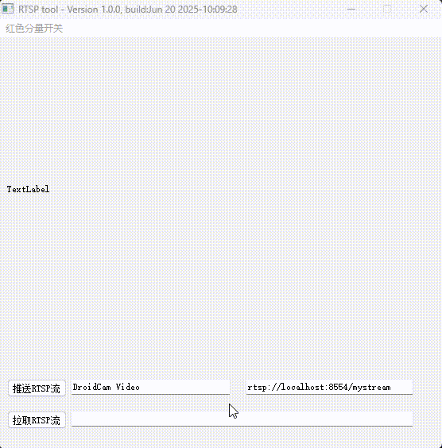

# RTSP视频流播放器（基于FFmpeg和Qt）

## 项目概述
这是一个基于FFmpeg和Qt框架开发的RTSP视频流工具，包含两大核心功能：
- RTSP视频流播放器
- RTSP视频流推送工具

源码是：https://github.com/VideosWorks/FFmpeg-QT-RTSP
本人在此基础上进行修改。

 <!-- 放置你的视频或波形演示动图 -->

---
 <!-- 放置你的视频或波形演示动图 -->

## 📡 Public RTSP Test Streams (Verified)

The following RTSP streams are available for testing purposes. Note that public streams may become unavailable without notice.

| Location            | RTSP URL                                      | Latency | Status       |
|---------------------|-----------------------------------------------|---------|--------------|
| Nordland            | `rtsp://77.110.228.219/axis-media/media.amp` | 200ms   | ✅ Working   |
| Norwich             | `rtsp://37.157.51.30/axis-media/media.amp`   | 250ms   | ✅ Working   |
| Orlando             | `rtsp://97.68.104.34/axis-media/media.amp`   | 350ms   | ⚠️ Unstable |
| PriceCenterPlaza    | `rtsp://132.239.12.145:554/axis-media/media.amp` | 280ms | ✅ Working   |
| Vaison-La-Romaine   | `rtsp://176.139.87.16/axis-media/media.amp`  | -       | ❌ Offline   |
| VyhladJazero        | `rtsp://stream.strba.sk:1935/strba/VYHLAD_JAZERO.stream` | 160ms | ✅ Working |
| Western Cape        | `rtsp://196.21.92.82/axis-media/media.amp`   | 450ms   | ⚠️ High Latency |
| Zeeland             | `rtsp://213.34.225.97/axis-media/media.amp`  | 270ms   | ✅ Working   |
| Allendale           | `rtsp://71.83.5.156/axis-media/media.amp`    | 270ms   | ✅ Working   |
| Bedford Hills       | `rtsp://73.114.177.111/axis-media/media.amp` | 340ms   | ✅ Working   |

## 功能特性
1. **播放器功能**：
   - 支持RTSP协议（强制TCP传输）
   - 自动重连机制（网络中断恢复）
   - 视频画面自适应窗口大小
   - 红色通道提取与显示
   - 图像二值化处理（实验性功能）

2. **推流功能**：
   - 支持摄像头设备推流（DShow）
   - 支持本地视频文件循环推流
   - 自动重启机制（进程崩溃恢复）
   - 可配置编码参数（H.264编码）
   - 实时状态监控与日志输出

## 技术栈
- **核心库**：
   - FFmpeg（编解码、流媒体处理）
   - Qt 5（GUI框架）
- **关键技术：**：
   - FFmpeg的dshow设备采集
   - RTSP/TCP传输协议
   - QProcess进程管理
   - 多线程视频处理

## 编译与运行
### 依赖项
- Qt 5.15+（需包含Core、Gui、Widgets模块）
- FFmpeg 4.3+（需包含以下库）：
   - avcodec
   - avformat
   - avutil
   - swscale
   - swresample

### 编译步骤
1. 确保已安装Qt Creator和FFmpeg开发库
2. 克隆本项目
3. 使用Qt Creator打开.pro工程文件
4. 配置FFmpeg库路径
5. 编译并运行

## 使用说明
1. **主界面**：
   - 在URL输入框输入RTSP地址（如rtsp://localhost:8554/mystream）和输出需要推送的流数据（DroidCam Video）
   - 点击"推送流"按钮进行推送
   - 在URL输入框输入RTSP地址（如rtsp://localhost:8554/mystream）
   - 点击"拉取流"按钮开始播放
   
2. **菜单操作**：
   - "Open_red"：开启红色通道显示
   - "Close_Red"：关闭红色通道显示

3. **注意事项**：
   - 如需更改RTSP流地址，请修改`videoplayer.cpp`中的URL
   - 网络延迟设置默认为100ms

## 作者信息
- 作者：梅启升
- 技术博客：github
- github博客：https://github.com/meiqisheng
- 联系QQ：2998919730@qq.com

## 许可证
本项目采用MIT许可证开放源代码。